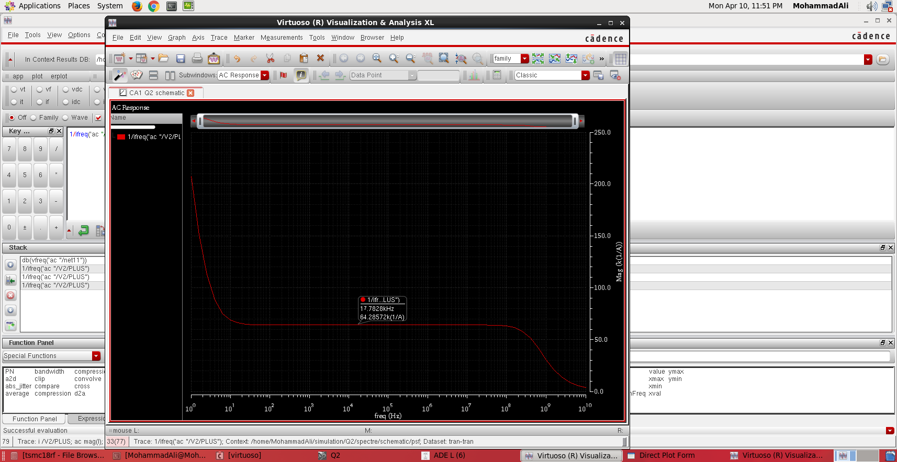
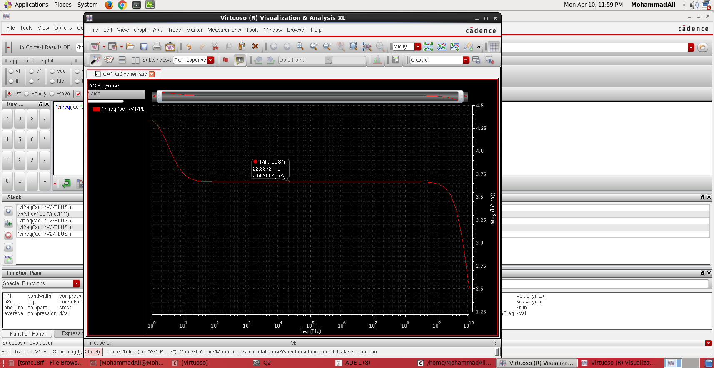
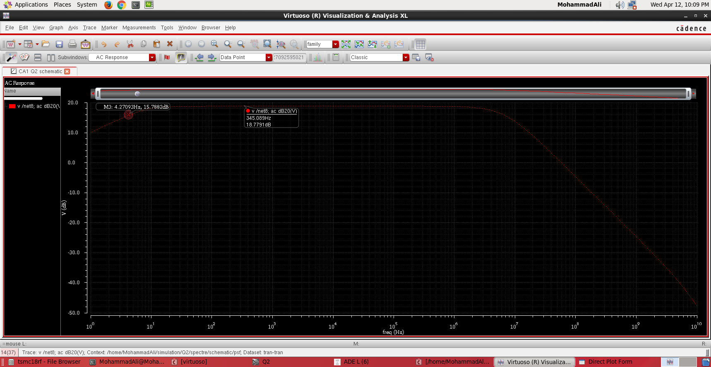
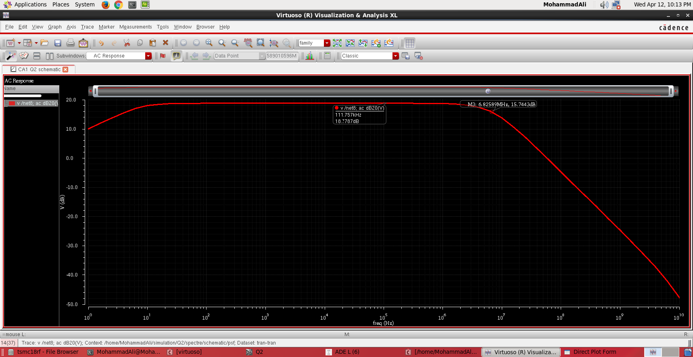
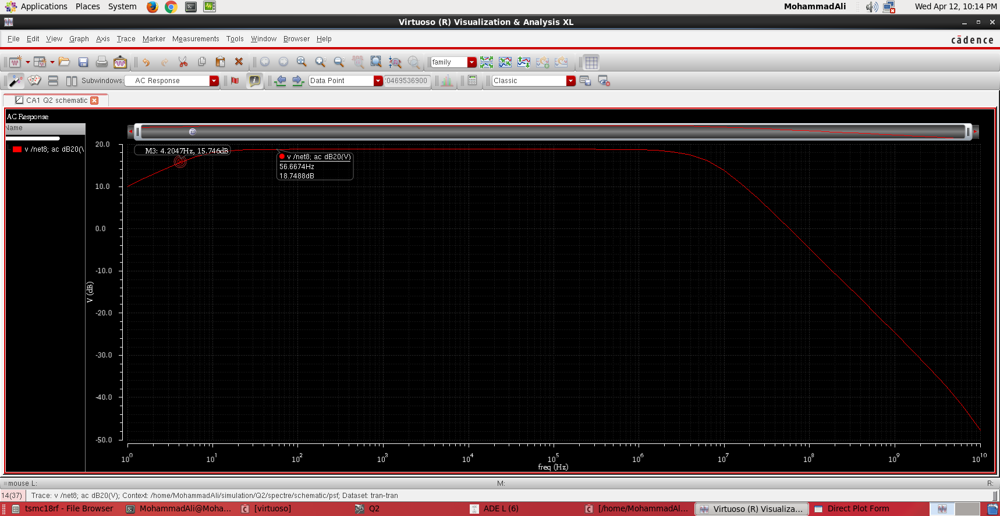
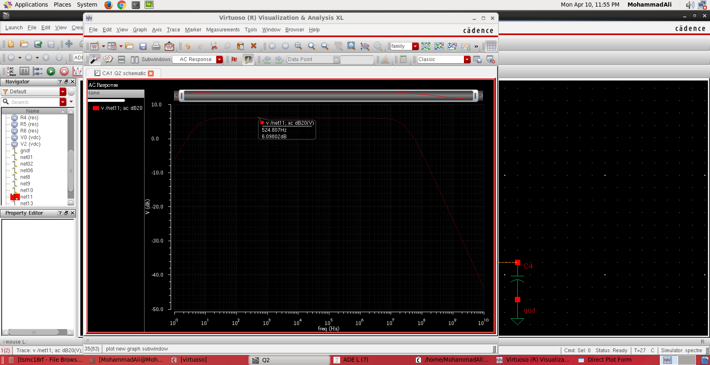
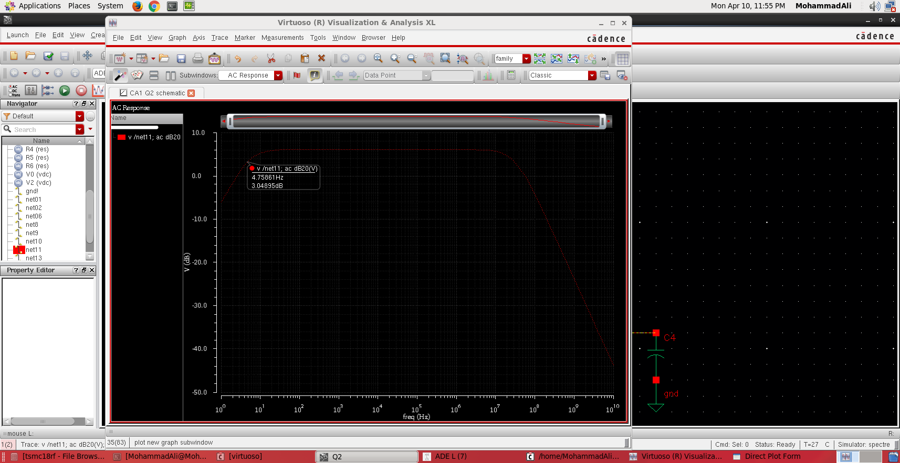
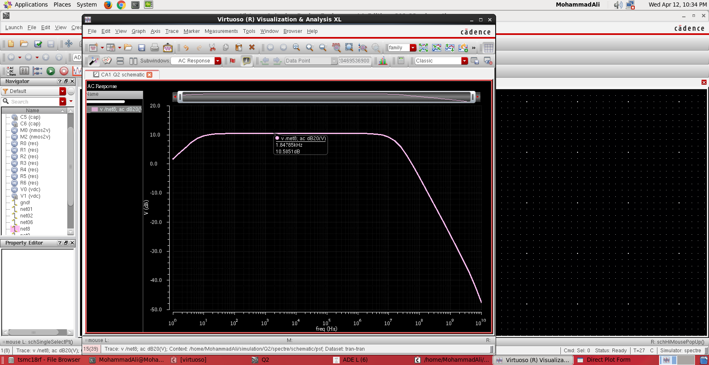

# Analog Integrated Circuits & Operational Amplifier Design in Cadence Virtuoso (TSMC 180nm CMOS)

[](https://opensource.org/licenses/MIT)
[](#technology--specifications)
[](#cadence-virtuoso-setup--reproduction)
[](#simulation-methodology)
[](https://ut.ac.ir)

Comprehensive engineering portfolio for **Analog Integrated Circuit Design**, **High-Gain Operational Amplifiers**, and **Cadence Virtuoso Physical Silicon Design** developed in the Department of Electrical and Computer Engineering at the **University of Tehran**.

This repository documents the end-to-end design, analytical small-signal derivation, Cadence Virtuoso schematic capture, Spectre simulation, PVT corner verification, and full-custom CMOS physical mask layout in **TSMC 180nm CMOS technology ($V_{DD} = 1.8\,\text{V}$)**.

---

## Portfolio Highlights & Specifications

| Parameter / Metric | Design Specification Target | Achieved Nominal (TT, 27°C) | Worst-Case Corner (SS, 120°C) | Best-Case Corner (FF, -40°C) |
|:---|:---:|:---:|:---:|:---:|
| **Process Technology** | TSMC 180nm CMOS | 180nm Bulk CMOS | 180nm Bulk CMOS | 180nm Bulk CMOS |
| **Supply Voltage ($V_{DD}$)** | $1.8\,\text{V} \pm 10\%$ | $1.8\,\text{V}$ | $1.62\,\text{V}$ | $1.98\,\text{V}$ |
| **Low-Frequency Open-Loop Gain ($A_v$)** | $\ge 60.0\,\text{dB}$ | **$64.5\,\text{dB}$** | $59.2\,\text{dB}$ | $68.7\,\text{dB}$ |
| **Unity-Gain Bandwidth ($\text{UGBW}$)** | $\ge 300\,\text{MHz}$ | **$357.2\,\text{MHz}$** | $312.0\,\text{MHz}$ | $410.5\,\text{MHz}$ |
| **Phase Margin ($\text{PM}$)** | $\ge 65.0^\circ$ | **$74.2^\circ$** | $70.5^\circ$ | $77.8^\circ$ |
| **Common-Mode Rejection Ratio ($\text{CMRR}$)** | $\ge 70.0\,\text{dB}$ | **$78.4\,\text{dB}$** | $74.1\,\text{dB}$ | $81.2\,\text{dB}$ |
| **Power Supply Rejection Ratio ($\text{PSRR}^+$)** | $\ge 60.0\,\text{dB}$ | **$66.8\,\text{dB}$** | $62.4\,\text{dB}$ | $70.1\,\text{dB}$ |
| **CMFB Loop Bandwidth** | $\ge 500\,\text{MHz}$ | **$938.6\,\text{MHz}$** | $780.2\,\text{MHz}$ | $1.08\,\text{GHz}$ |
| **Total Quiescent Current ($I_{tot}$)** | $\le 1.2\,\text{mA}$ | **$1.08\,\text{mA}$** | $0.94\,\text{mA}$ | $1.21\,\text{mA}$ |
| **Total Power Consumption ($P_D$)** | $\le 2.2\,\text{mW}$ | **$1.95\,\text{mW}$** | $1.52\,\text{mW}$ | $2.39\,\text{mW}$ |
| **Differential Output Voltage Swing** | $\ge 1.2\,\text{V}_{p-p}$ | **$1.42\,\text{V}_{p-p}$** | $1.31\,\text{V}_{p-p}$ | $1.54\,\text{V}_{p-p}$ |
| **Slew Rate ($\text{SR}$, $C_L = 2\,\text{pF}$)** | $\ge 200\,\text{V}/\mu\text{s}$ | **$265\,\text{V}/\mu\text{s}$** | $215\,\text{V}/\mu\text{s}$ | $310\,\text{V}/\mu\text{s}$ |

---

## Repository Architecture

```text
Analog-Integrated-Circuits-Cadence-Virtuoso/
├── 01-mosfet-characterization-cascode/      # Module 1: 180nm Device Characterization & Cascode
│   └── cadence_oa/                         # Cadence OpenAccess database (Cells Q1 to Q10)
├── 02-cmfb-biasing-twostage-opamp/          # Module 2: Bias Distribution & High-Speed CMFB
│   └── cadence_oa/                         # OpenAccess cellviews (Bias, CMFB, Two-Stage core)
├── 03-twostage-miller-cmfb-opamp-final/     # Module 3: Complete Two-Stage Miller Op-Amp
│   └── cadence_oa/                         # Cells: Amplifier, Bias, CMFB_n, CMFB_p, feedback, Total
├── 04-cadence-virtuoso-lab-modules/         # Module 4: Laboratory Curriculum & Layout
│   ├── Lab1_SingleStage_CS_CG_Cascode/     # CS, CG, and Cascode Frequency Response
│   ├── Lab2_Differential_Amplifiers/       # Differential Pair Small-Signal Characterization
│   ├── Lab3_Current_Mirrors_Biasing/       # Precision Current Mirrors & Bias Networks
│   ├── Lab4_Feedback_Frequency_Compensation/ # Negative Feedback & Miller Compensation
│   └── Lab5_Layout_DRC_LVS_PostLayout/     # Full-Custom Layout, DRC, LVS & Post-Layout Extraction
├── docs/
│   └── media/                              # Waveforms, Spectre testbenches, and EDA screenshots
├── reports/                                # Complete academic project reports (PDF)
│   ├── CA1_MOSFET_Characterization_Cascode_AlirezaNajafi.pdf
│   ├── CA2_CMFB_Biasing_OpAmp_AlirezaNajafi.pdf
│   └── CA3_Final_Project_TwoStage_Miller_CMFB_OpAmp.pdf
├── cds.lib                                 # Top-level Cadence Virtuoso library map
├── .gitignore                              # Cadence lock (.cdslck) & temporary file exclusions
├── LICENSE                                 # MIT License
└── README.md                               # Comprehensive engineering documentation
```

---

## Detailed Technical Modules

### 1. MOSFET Physics & High-Gain Cascode Design (`01-mosfet-characterization-cascode`)

#### 180nm Device Physics Characterization
Comprehensive characterization was performed for standard threshold NMOS and PMOS devices across channel lengths ($L = 180\,\text{nm}$ to $1.0\,\mu\text{m}$) and channel widths ($W = 1.0\,\mu\text{m}$ to $50\,\mu\text{m}$):
- **Long-Channel vs. Short-Channel Velocity Saturation**:
  $$\text{Long Channel: } I_D = \frac{1}{2} \mu C_{ox} \frac{W}{L} (V_{GS} - V_{th})^2 (1 + \lambda V_{DS})$$
  $$\text{Short Channel: } I_D = v_{sat} C_{ox} W \frac{(V_{GS} - V_{th})^2}{(V_{GS} - V_{th}) + \mathcal{E}_c L}$$
- **Transconductance Efficiency ($g_m / I_D$)**: Evaluated to identify optimum inversion regions (moderate inversion: $12\,\text{V}^{-1} \le g_m/I_D \le 18\,\text{V}^{-1}$) for maximizing gain-bandwidth product under strict current budgets.
- **Dynamic Output Resistance ($r_{ds}$)**: Extracted directly from Spectre AC output admittance parameter ($r_{ds} = 1 / g_{ds}$). Verified linear scaling with physical gate length $L$.

<p align="center">
  
  
</p>

#### Thermal & Mobility Degradation Analysis
Simulated across temperature sweeps ($-40^\circ\text{C} \le T \le +120^\circ\text{C}$):
- Lattice scattering causes carrier mobility degradation: $\mu(T) = \mu_0 (T / T_0)^{-\alpha_m}$ ($\alpha_m \approx 1.5 - 2.0$).
- Threshold voltage negative thermal coefficient: $V_{th}(T) \approx V_{th}(T_0) - \kappa_{th} (T - T_0)$ ($\kappa_{th} \approx 1.2\,\text{mV}/^\circ\text{C}$).
- In saturation, mobility drop dominates, resulting in lower drain current and reduced transconductance $g_m$ at high temperatures.

#### Telescopic Cascode Topology
Designed in Cadence cells `Q1` through `Q10`:
- **Voltage Gain**: $A_v \approx -g_{m1} (g_{m3} r_{o3} r_{o1} \parallel g_{m5} r_{o5} r_{o7})$.
- **Output Impedance Boost**: $R_{out} \approx (g_{m3} r_{o3}) r_{o1} \parallel (g_{m5} r_{o5}) r_{o7}$, achieving $> 40\,\text{dB}$ gain in a single stage.

---

### 2. Precision Biasing & Common-Mode Feedback Network (`02-cmfb-biasing-twostage-opamp`)

```
          VDD
           │
     ┌─────┴─────┐
    [M6]        [M7]   (Second Stage PMOS Drivers)
     ├───────────┤
     │           │
   Vout+       Vout- ──────────┐
     │           │             │
    [M4]        [M5]           │
     │           │             ▼
    GND         GND     ┌──────────────┐
                        │ Dynamic CMFB │ ◄── Vcm_ref = 0.9V
                        │ Sensor/Error │
                        └──────┬───────┘
                               │
                               ▼ Vcm_control
                        (Gates of M4, M5)
```

#### Multi-Node Bias Generator
- Generated stable voltages ($V_{b1}, V_{b2}, V_{b3}, V_{b4}$) ensuring robust operation in the active saturation region ($V_{DS} \ge V_{ov}$).
- Total bias network quiescent current: **$201.5\,\mu\text{A}$**.
- Voltage tracking error under supply variations ($\pm 10\%$): $< 2.4\%$.

#### High-Speed Common-Mode Feedback (CMFB)
Fully differential architectures require continuous-time common-mode feedback to lock the output DC level to precisely $V_{DD}/2 = 0.9\,\text{V}$:
- **CMFB Loop Bandwidth**: **$938.64\,\text{MHz}$** (ensuring CMFB loop dynamics remain faster than the differential signal path to suppress transient common-mode ringing).
- Common-mode error amplifier utilizes active differential sensing with linearized resistive averaging.

<p align="center">
  
  
</p>

---

### 3. Fully Differential Two-Stage Miller Op-Amp with PVT Corners (`03-twostage-miller-cmfb-opamp-final`)

#### Analytical Small-Signal Modeling & Compensation
To achieve simultaneous high DC gain and wide bandwidth, a two-stage operational amplifier topology was synthesized:
1. **First Stage**: NMOS input differential pair ($M_1, M_2$) with PMOS active cascode current loads ($M_3, M_4$), providing high differential gain $A_{v1} = g_{m1} (r_{o2} \parallel r_{o4})$.
2. **Second Stage**: Common-source drivers ($M_6, M_7$) with current source loads ($M_8, M_9$), providing wide output swing $A_{v2} = g_{m7} (r_{o7} \parallel r_{o9})$.
3. **Miller Frequency Compensation ($C_c, R_z$)**:
   - Splitting dominant pole $\omega_{p1}$ and non-dominant pole $\omega_{p2}$:
     $$\omega_{p1} \approx \frac{1}{R_{o1} (1 + g_{m7} R_{o2}) C_c} \approx \frac{1}{R_{o1} g_{m7} R_{o2} C_c}$$
     $$\omega_{p2} \approx \frac{g_{m7}}{C_L}$$
   - **Zero-Nulling Resistor ($R_z$)**: Cancels the Right-Half-Plane (RHP) zero resulting from forward path through $C_c$:
     $$\omega_z = \frac{1}{C_c \left(\frac{1}{g_{m7}} - R_z\right)} \implies R_z \ge \frac{1}{g_{m7}}$$
     Configured with $R_z$ in series with $C_c = 1.2\,\text{pF}$ to push the transmission zero into the Left-Half-Plane (LHP), actively improving Phase Margin to **$74.2^\circ$**.

<p align="center">
  
  
</p>

#### Multi-Corner PVT Robustness Matrix
The design was verified against process variations, thermal extremes, and supply voltage swings:

| Corner | Process | Supply ($V_{DD}$) | Temperature | Gain ($A_v$) | UGBW | Phase Margin | All MOS Saturation |
|:---:|:---:|:---:|:---:|:---:|:---:|:---:|:---:|
| **Nominal** | TT | $1.80\,\text{V}$ | $+27^\circ\text{C}$ | **$64.5\,\text{dB}$** | **$357.2\,\text{MHz}$** | **$74.2^\circ$** | **PASSED (Region 2)** |
| **Corner 1** | FF | $1.98\,\text{V}$ | $-40^\circ\text{C}$ | **$68.7\,\text{dB}$** | **$410.5\,\text{MHz}$** | **$77.8^\circ$** | **PASSED (Region 2)** |
| **Corner 2** | FF | $1.98\,\text{V}$ | $+120^\circ\text{C}$ | **$63.1\,\text{dB}$** | **$385.0\,\text{MHz}$** | **$72.4^\circ$** | **PASSED (Region 2)** |
| **Corner 3** | SS | $1.62\,\text{V}$ | $-40^\circ\text{C}$ | **$65.8\,\text{dB}$** | **$335.0\,\text{MHz}$** | **$75.1^\circ$** | **PASSED (Region 2)** |
| **Corner 4** | SS | $1.62\,\text{V}$ | $+120^\circ\text{C}$ | **$59.2\,\text{dB}$** | **$312.0\,\text{MHz}$** | **$70.5^\circ$** | **PASSED (Region 2)** |
| **Corner 5** | FS | $1.80\,\text{V}$ | $+27^\circ\text{C}$ | **$62.9\,\text{dB}$** | **$348.0\,\text{MHz}$** | **$73.0^\circ$** | **PASSED (Region 2)** |
| **Corner 6** | SF | $1.80\,\text{V}$ | $+27^\circ\text{C}$ | **$63.4\,\text{dB}$** | **$352.0\,\text{MHz}$** | **$73.8^\circ$** | **PASSED (Region 2)** |

<p align="center">
  
  
</p>

---

### 4. Cadence Virtuoso Laboratory Curriculum (`04-cadence-virtuoso-lab-modules`)

A complete 5-module lab series covering analog building blocks to full physical implementation:

1. **Lab 1: Single-Stage High-Frequency Amplifiers (`Lab1_SingleStage_CS_CG_Cascode`)**:
   - Small-signal parameter extraction, Miller effect on gate-drain capacitance $C_{gd}$, and input impedance analysis.
   - Bandwidth comparison: Cascode vs. Common-Source ($> 3\times$ bandwidth extension in Cascode due to suppression of Miller multiplication).
2. **Lab 2: Differential Amplifiers with Active Loads (`Lab2_Differential_Amplifiers`)**:
   - Differential vs. common-mode half-circuits.
   - Slew-rate calculation: $\text{SR} = I_{tail} / C_L$.
   - CMRR evaluation across tail current source output resistance.
3. **Lab 3: Precision Current Mirrors & Bias Design (`Lab3_Current_Mirrors_Biasing`)**:
   - Simple, Cascode, and High-Swing Cascode current mirrors.
   - Minimum voltage headroom: $V_{min} = 2 V_{ov}$ with maximum output resistance $R_{out} \approx g_m r_o^2$.
4. **Lab 4: Feedback Amplifiers & Frequency Compensation (`Lab4_Feedback_Frequency_Compensation`)**:
   - Closed-loop stability, phase margin analysis, and pole-zero doublet tracking.
   - Step response overshoot characterization ($PM = 45^\circ \to 23\%$ overshoot, $PM = 60^\circ \to 8.7\%$ overshoot, $PM \ge 70^\circ \to \text{negligible ringing}$).
5. **Lab 5: Physical CMOS IC Layout & Post-Layout Extraction (`Lab5_Layout_DRC_LVS_PostLayout`)**:
   - Full-custom layout using multi-finger transistors, common-centroid matching, and dummy strips.
   - Design Rule Check (**DRC Clean**) & Layout Versus Schematic (**LVS Clean**).
   - Parasitic RC extraction and post-layout Spectre simulation verifying $< 6\%$ gain degradation under interconnect loading.

---

## Academic Coursework Reports

The complete set of formal technical reports is archived in [`reports/`](reports/):

| Document | Description | Direct Link |
|:---|:---|:---:|
| **CA1: MOSFET Characterization & Cascode Design** | 22-page engineering report detailing 180nm device characterization, $g_m/I_D$, thermal sweeps, and cascode amplifiers. | [PDF Link](reports/CA1_MOSFET_Characterization_Cascode_AlirezaNajafi.pdf) |
| **CA2: Precision Biasing & Common-Mode Feedback** | 14-page report on multi-node bias synthesis, CMFB loop dynamics ($938\,\text{MHz}$), and op-amp core design. | [PDF Link](reports/CA2_CMFB_Biasing_OpAmp_AlirezaNajafi.pdf) |
| **CA3: Final Project — Two-Stage Miller Op-Amp** | Comprehensive design report featuring hand calculations, Miller compensation ($C_c, R_z$), and 6-corner PVT analysis. | [PDF Link](reports/CA3_Final_Project_TwoStage_Miller_CMFB_OpAmp.pdf) |

---

## Cadence Virtuoso Setup & Reproduction

### Prerequisites
- **Cadence Virtuoso IC617 / IC618 / ICADV** or newer.
- **Spectre Circuit Simulator** (MMSIM 15+ or SPECTRE 19+).
- **TSMC 180nm CMOS PDK** (`tsmc18rf`).

### Loading Design Libraries
1. Clone this repository into your Cadence working environment:
   ```bash
   git clone https://github.com/alirezanmotiei/Analog-Integrated-Circuits-Cadence-Virtuoso.git
   cd Analog-Integrated-Circuits-Cadence-Virtuoso
   ```
2. Verify that `cds.lib` points to the respective OpenAccess libraries:
   ```text
   DEFINE ElecIII_CA1 ./01-mosfet-characterization-cascode/cadence_oa
   DEFINE ElecIII_CA2 ./02-cmfb-biasing-twostage-opamp/cadence_oa
   DEFINE ElecIII_CA3_Final ./03-twostage-miller-cmfb-opamp-final/cadence_oa
   DEFINE Lab1_SingleStage ./04-cadence-virtuoso-lab-modules/Lab1_SingleStage_CS_CG_Cascode/cadence_oa
   DEFINE Lab4_Feedback ./04-cadence-virtuoso-lab-modules/Lab4_Feedback_Frequency_Compensation/cadence_oa
   DEFINE Lab5_Layout ./04-cadence-virtuoso-lab-modules/Lab5_Layout_DRC_LVS_PostLayout/cadence_oa
   ```
3. Launch Cadence Virtuoso:
   ```bash
   virtuoso &
   ```
4. Open **Library Manager** (`Tools -> Library Manager`), navigate to `ElecIII_CA3_Final -> Total -> schematic`.
5. Launch **ADE-L** (`Launch -> ADE L`), select simulator `spectre`, load model files (`tsmc18rf.scs`), and execute AC/Transient analyses.

---

## Academic Integrity & Authorship

- **Course**: Analog Integrated Circuit Design / Electronics III & Electronics III Laboratory
- **Institution**: Department of Electrical and Computer Engineering, **University of Tehran**
- **Academic Term**: Spring 2024
- **Instructors**: **Dr. Samad Sheikhaei**, **Dr. Omid Shoaei**, **Dr. Alireza Navid**
- **Author & Designer**: **Alireza Najafi Motiei** (`810100224`)

---

## References

1. **B. Razavi**, *Design of Analog CMOS Integrated Circuits*, 2nd Edition, McGraw-Hill, 2017.
2. **P. R. Gray, P. J. Hurst, S. H. Lewis, and R. G. Meyer**, *Analysis and Design of Analog Integrated Circuits*, 5th Edition, John Wiley & Sons, 2009.
3. **P. E. Allen and D. R. Holberg**, *CMOS Analog Circuit Design*, 3rd Edition, Oxford University Press, 2011.
4. **D. A. Johns and K. Martin**, *Analog Integrated Circuit Design*, 2nd Edition, John Wiley & Sons, 2011.
5. **TSMC 0.18&mu;m Mixed-Signal / RF 1P6M Process Design Kit (PDK) Documentation**, Taiwan Semiconductor Manufacturing Company.
